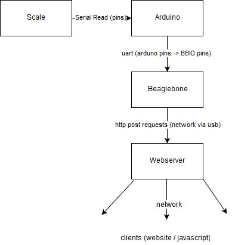

# Force Gauge - Team A
In this project we aimed to develop a force gauge which was capable of detecting the force applied from a human punch. This document outlines the goals of the project, the design of the system, and the final resulting prototype which was delivered.

> To best view this document, use the [link](https://github.com/FredericDesgreniers/SOEN422_project/blob/master/Docs/Full-Scale/README.md) provided.

### Table of Contents
1. [Contributors](#contributors)
1. [Introduction](#introduction)
1. [Description](#description)
   1. [Name](#name)
   1. [function](#function)
   1. [performance](#performance)
   1. [scope of complition](#scope-of-completion)
1. [Hardware Design](#hardware-design)
   1. [System](#system)
   1. [Subsystems](#subsystems)
   1. [intercommunication](#intercommunication)
1. [Software Design](#software-design)
   1. [System Design](#system-design)
   1. [Subsystems](#subsystems)
      1. [Arduino Functions](#arduino)
      1. [BeagleBone functions](#beaglebone---python)
      1. [External functions](#external)
   1. [System Software Communication](#system-software-communication)
1. [development software/enviroments]()
1. [system delivery]()
   1. [initialisation]()
   1. [operation]()
1. [discussion]()
1. [Apendix]()

## Contributors
**Name** | **ID**
:--:|---
Christopher McArthur | `40004257`
Frederic Desgreniers | `40016777`

## Description
This force gague system, called the **Punch O-Meter**, is designed to be placed into any punching bag and display live results of the forces being applied. The system would include a web server and with an internet connection allowing users to view the data from their computer or mobile device. This data is the _force_ currently applied to the bag which is being captured by a microcontroller of the force gauge(s) set up in the bag. It is designed to capture the force from various types of punchs, meaning it is responsive enough to capture a quick double jab and strong enough to handle a left hook. Users are able to display the force in pounds, kilos, or newtons and track sessions to see the greatest force applied during their training.

The project succeded is producing a functional prototype which was able to capture the force applied and displayed the results through a web interface. However the lantency of the system was never refined to be low enough to capture a punch reliably.

## Hardware Design
### System
_TODO:_ describe overall system

### Subsystems
#### Force Gauge
The main hardware component is the force gauge itself, this went through many phases thought stuck with the initial concept of usign fource loadcells to mesure the weight (ie force) being applied. The first step was a proof of concept model which used a single loadcell as a scale and printed the weight. The loadcell was a wheatestone bridge type which was connected to an HX711; a specialized amplifer for these types of loadcells. The output of the HX711 was digital and made it easily captured by an Arduino Nano which used serial (UART) communication to desplay the results on a monitor.

The concept model was two circular plates with the four loadcells in between positioned an equal distance for the center and aligned at 90 degrees. This layout was changed early on in the development of the full scale model for serval factors:
- Calculating the geometry of the system was more complex
- Limitations in supply/availibilty of material (turn rectangles into circles)

For these reasons we opted for two rectangular plates; the top plate is `3x4x1/4` and the bottom plate is `5x4x1/4`. The top plate is centered over the bottom plate with an inch margin on the left and right sides of the force gauge. The top plate is smaller to provide a concentrate area to deliver the force as well as the requirements of the loadcell's placement.

#### Microcontrollers
_TODO:_ describe thier role

### Intercommunication
_TODO:_ How they are connected

## Software Design
### System Design
The software was responsible for transfering the values outputed by the scale from the arduino to the beaglebone and finalyl to the webserver. 

**Arduino**
TODO: Described arduino software

**BeagleBone**
On the bealebone, a python program was used in order to bridge communication between the arduino and the web server used to render a chart of the force applied.

The python program was meant to send the values using an http POST request to a java webserver, also hosted on the beaglebone. However, the server ended up being hosted an external computer due to a faillure to get some of the dependencies to work on the beaglebone's version of Debian. 

### Subsystems
#### Arduino
TODO: Arduino subsystem

#### Beaglebone - Python
A python script was used to bridge the communication between the arduino and the java web server. The script used a library called PySerial. 
```python
import serial
import requests

ser = serial.Serial('/dev/ttyO2', 9600)

while True:
   dataValue = ser.readline()
   requests.post('http://192.168.7.1/data', data = dataValue)
   
ser.close() 
```

##### Code Explanation

`serial.Serial('/dev/ttyO2',9600)` opens the uart2 port (ttyO2) for communication with a baudrate of 9600. `PySerial` itself [will call `os.open()`](https://github.com/pyserial/pyserial/blob/92d101613be41ecb2f2054c3f43a006fbe6f9966/serial/serialposix.py#L265) using the port name which will return a file descriptor, which in this case is a handle to the port. 

[`ser.readline()` from `io::IoBase`](https://docs.python.org/2/library/io.html#io.IOBase.readline) is a standard python method that reads a stream by calling calls the `IoBase::read()` method until a new line is found. 

The `read()` method is [overriden by `PySerial`](https://github.com/pyserial/pyserial/blob/master/serial/serialposix.py#L471). The posix version of the PeSerial code will then call python's `select.select()` method, which [translates to a `select()` system call on linux](https://docs.python.org/2/library/select.html#select.select). This will wait until the port is ready to read and then calls `os.read()` on the serial port to read the data comming from the uart connection. 

`requests.post(..)` is part of the standard python libraries and makes a standard http post request the local java server. 


### External
#### Java
A java webserver using the Spring Boot framework is responsible for displaying the values sent by the python server on a web page. 
The webpage uses a chart library (CanvasJS) and websockets in order to constantly update the values. 

The spring boot application enables websocets using `@EnableWebSocketMessageBroker` on the main config class. 

It then registers a web socket entry point using
```java
@Override
public void configureMessageBroker(MessageBrokerRegistry config) {
    config.enableSimpleBroker("/data");
    ...
}
```
That makes it so a client can connect to a websocket using /data/sub.

This can be seen in the javascript code:
```javascript
stompClient.subscribe('/data/sub', function (message){
    var dataToShow = JSON.parse(message.body);
    dps.push({
        x: dataToShow.time,
        y: dataToShow.force
    });
    if (dps.length > dataLength) {
        dps.shift();
    }
    chart.render();
});
```
It subscribes to /data/sub and then pushes a new value to the chart every time a message gets received. 
Every time a value is sent to /data using POST, this method gets triggered: 
```java
@RequestMapping("/data")
public ResponseEntity<String> data(@RequestBody String body) {

    template.convertAndSend("/data/sub", new DataMessage(index.getAndIncrement(), Float.valueOf(body)));

    return ResponseEntity.status(200).build();
}
```

Since only the value is sent in the POST request body, we can convert it directly to a float using `float.valueOf(body)`. 
`template.convertAndSend(...)` will send a websocket message made of an index integer and a float to all the subscribers of the /data/sub websocket. 

### System-Software-Communication
The scale has a built in analog to serial conversion (TODO: confirm this), which means the arduino can do a serial read using serial pins. The arduino will then send the number as a string of characters and a new line to the beaglebone using UART (TX/RX pins on both) which nis read by a python script. The beaglebone will take the values and send them over the local network to the computer running the java web server. The connection from the beaglebone to the computer / webserver is done over usb network sharing. The web server will then use the network to send websockets to the clients. 


## Development Software

### Arduino
TODO: Add software / programs used
### Beaglebone

#### Vim / Nano
Used for code / config editing. Both were are installed by default on the linux distribution. 

#### Cape manager
Used to add the UART overlay. Installed by default.

#### Python
Used for scriping.

`PySerial` was downloaded using python's pip command, also installed by default. 

### External
Java was used to run the webserver.

Intellij was used for creating the java web server along with maven for dependency management. 

Putty and Ubunutu subsystem for windows were used to shh into the beaglebone.
